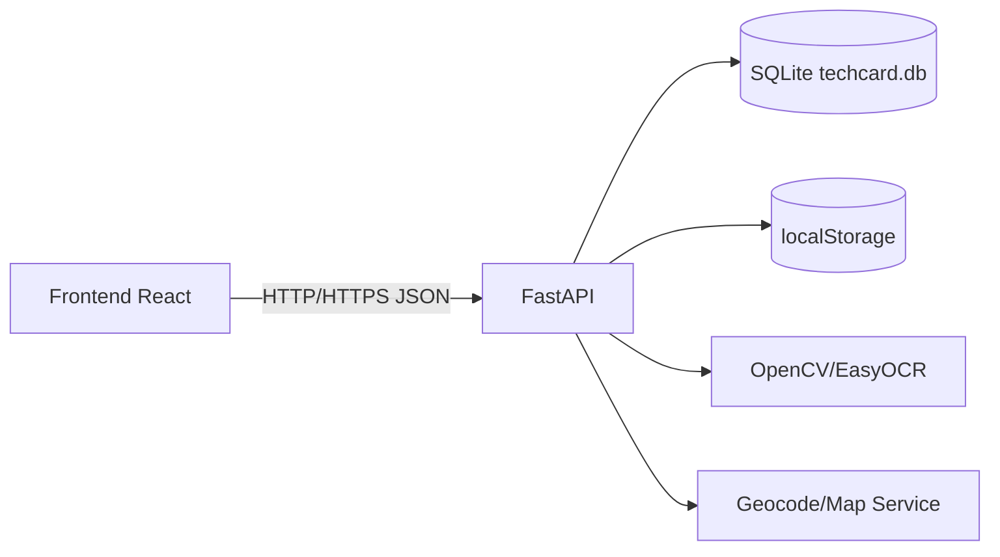

# TechCard

このリポジトリには、エンジニアの名刺を管理するためのフルスタックアプリケーションが含まれています。

## バックエンド

バックエンドは `backend/app` にある FastAPI アプリケーションです。

### セットアップ

```bash
cd techcard/backend
python -m venv .venv  # Python 3.11.8 を使用
source .venv/bin/activate
pip install -r requirements.txt
```

SQLite（`techcard.db`）をストレージとして使用し、ORMには SQLAlchemy を使います。

## フロントエンド

フロントエンドは `frontend` にある React アプリケーションで、TypeScript と TailwindCSS を使用しています。

### セットアップ

```bash
cd techcard/frontend
npm install
```

## クイックスタート

### dev_start.sh（推奨）

フロントエンド・バックエンド（HTTP/HTTPS）をまとめて起動します。起動後にブラウザを開きます。

```bash
cd techcard
./dev_start.sh
```

起動ポート:
- フロントエンド: `http://localhost:3000`
- バックエンド（HTTP）: `http://localhost:8000`
- バックエンド（HTTPS）: `https://localhost:8443`

### 手動起動

1. **バックエンドを起動（HTTP: 8000）**:
   ```bash
   cd techcard/backend
   source .venv/bin/activate  # 仮想環境をアクティブ化
   python -m uvicorn app.main:app --reload --host 0.0.0.0 --port 8000
   ```
   API が `http://localhost:8000` で利用可能になります。

2. **フロントエンドを起動**:
   ```bash
   cd techcard/frontend
   npm start
   ```
   ブラウザで `http://localhost:3000` にアクセス。

バックエンドの仮想環境が既にセットアップされていることを前提としています。初回は各ディレクトリで `npm install` または `pip install -r requirements.txt` を実行してください。

## スマホ撮影（QR）

旧「スマホで撮影（QR表示）」はHTTPS証明書が必要なため**廃止**しました。現在は **HTTP（8000）** で動く簡易アップロードを使用します。

### カメラ起動までの流れ
1. `./dev_start.sh` で起動
2. ブラウザで `http://localhost:3000` を開く
3. 連絡先登録 → 「スマホ撮影」を押す
4. QRをiPhoneで開く（`http://<PCのIP>:8000/mobile-upload`）
5. 撮影して送信

PCとスマホは**同一Wi-Fi**が必要です。

### 連続登録モード
- PC側で「連続登録」をONにすると、同一QRで連続アップロードできます。
- 登録成功時はバナー表示のみ（自動消去）。
- 連続登録時は会社名/電話番号/郵便番号/住所を保持。
- OCRは**空欄のみ**埋めます（既存値は上書きしない）。

## 画像仕様

- OCR入力画像は `1200 × 700 px` に正規化
- 読み込み画像／PC撮影／スマホ撮影すべて同一サイズ

## 名刺アップロード/クロップ/OCRフロー

1. 名刺画像をアップロード/撮影
2. 名刺枠の**自動検出**（4点）
3. 手動で4点をドラッグ調整
4. 「クロップ実行」
5. 元画像/クロップ後を選択して確定
6. ROIを調整
7. 「OCR実行」で抽出

## 連絡先の重複チェック

- 重複判定は**氏名 + 会社名**の組み合わせ
- 重複時は UI で上書き確認

## タグ

- 既存タグから選択追加
- 手入力で新規追加
- 既存タグの削除が可能
- 選択肢は昇順表示

## 連絡先一覧/詳細

- 会社ごとのカード表示（デフォルト折りたたみ）
- 氏名下に役職・部署表示
- 初回に会った日を編集可能（新規登録は当日）
- メモ表示

## OCRの整形

- 会社名の全角空白除去
- 氏名は「名字 名前」形式へ正規化
- 役職・部署の連続空白を正規化
- メール末尾のドット欠落補正

## ROIエディタ

- ラベル文字サイズ16（赤字）
- 枠線は赤の実線（透過）
- 固定比率なしで自由リサイズ
- 余白ドラッグで ROI 全体移動
- ROI 位置は `localStorage`（`techcard_roi_template`）に保存
- 「ROIリセット」で既定値復帰

## ネットワークグラフ

- 会社ノードも接続（company_uses）
- タイプON/OFF + ハイライト
- ズーム連動ラベル表示
- レイアウト保存: `techcard_network_layout_v1`
- グリッド設定: `techcard_grid_config`
- **固定ノード仕様（重要）**: グリッドOFF時、固定ノードはドラッグ不可。レイアウトリセットで固定状態を解除。

## AI向け仕様書（実装継続用）

# Project Specification

## 1. プロジェクト概要

- アプリケーション名: TechCard
- 目的: 名刺画像を使って連絡先情報を登録・編集・検索し、会社/技術/イベントと関係図で可視化する
- 想定ユーザー: エンジニア向け個人開発者、SIer/PJ担当の技術担当者、営業や広報の名刺整理担当
- 解決する問題: 手入力の手間・重複登録・情報欠損の増幅を抑止する
- 使用環境: macOS + VS Code を想定したローカル開発、SQLite ベース

## 2. 技術スタック

- フロントエンド: React, TypeScript, TailwindCSS, Axios, react-force-graph-2d, react-konva, react-map-gl, maplibre-gl
- バックエンド: FastAPI, SQLAlchemy, Pydantic, uvicorn, python-multipart
- 言語: TypeScript, Python
- フレームワーク: React 18, FastAPI
- ビルドツール: Vite（推定）, npm scripts, uvicorn
- データ保存方法: SQLite (`techcard.db`), `localStorage`
- AI関連ライブラリ: EasyOCR, OpenCV, NumPy, Pillow, heif-convert
- その他依存ライブラリ: qrcode, d3, date handling系ライブラリ（既存プロジェクト標準）

## 3. プロジェクト構造

project-root
- backend/
  - app/
    - models.py
    - schemas.py
    - main.py
    - routers/
    - services/
    - utils/
  - data/
  - uploads/
  - certs/
  - logs/
- frontend/
  - src/
    - components/
    - pages/
    - hooks/
    - types/
    - App.tsx
  - public/
  - package.json
- dev_start.sh
- README.md

各フォルダ役割:
- backend/app/main.py: FastAPI初期化、ルーティング登録、依存関係の定義
- backend/app/models.py: DBテーブル定義
- backend/app/schemas.py: API入出力バリデーション
- backend/app/routers: エンドポイント実装
- backend/app/services: OCR/画像処理/外部API処理
- backend/data, backend/uploads: 画像保存・変換中データ
- frontend/src/pages: 各画面
- frontend/src/components: 再利用UI
- frontend/src/types: 型定義

## 4. アプリケーションアーキテクチャ

- UI構造: サイドバー＋メインビューのSPA。ルート単位で画面切替
- データフロー:
  - 画面イベント -> API呼び出し -> 状態更新 -> 描画
  - 成功時はlocalStorageへ必要値を保持、再描画で初期値復元
- API通信: REST/JSON。ファイル操作はmultipart/form-data
- 状態管理: Reactローカルstate中心（Global storeは現状未採用）
- AI処理: バックエンドの画像検出/OCRジョブ経由
- ファイル保存: 画像は規格化して一時保存、JSON情報はSQLite永続化、UI状態はlocalStorage



## 5. 機能一覧

| 機能名 | 説明 |
|---|---|
| 連絡先管理 | 連絡先登録/編集/削除/検索（重複チェック付き） |
| 会社管理 | 会社情報管理、会社ノードとの紐付け |
| タグ管理 | タグ追加・削除・付与・抽出 |
| イベント管理 | 予定/参加者登録、イベント詳細 |
| 名刺アップロード | 画像アップロード、名刺枠自動検出、手動補正 |
| ROI OCR | ROI編集、OCR実行、結果をフォームへ反映 |
| スマホ撮影 | 同一LAN内スマホからのHTTPアップロード |
| ネットワークグラフ | 会社/連絡先ノードの可視化、検索、タイプ切替 |
| 地図表示 | 会社所在地の表示と診断 |
| AI整形 | 氏名/部署/会社名の正規化ルール適用 |
| ローカル保存 | レイアウト/ROI/検索条件を永続化 |

## 6. 画面仕様

### 画面名: `/`（ホーム）
- 目的: 全体機能の起点、最近情報の確認
- UI構成: 統計サマリー、主な遷移ボタン、リストショートカット
- イベント: 画面遷移、検索/フィルタ

### 画面名: `/contacts`
- 目的: 連絡先一覧・重複確認・詳細アクセス
- UI構成: 検索欄、フィルタ、カード表示、ページング
- イベント: 編集、削除、詳細遷移

### 画面名: `/contacts/register`, `/contacts/:id/edit`
- 目的: 連絡先の新規作成/更新
- UI構成: 入力フォーム、タグ選択、保存/キャンセル
- イベント: 重複警告、保存時API呼び出し

### 画面名: `/card-upload`
- 目的: 名刺画像取込〜OCRまでの一連処理
- UI構成: 画像アップロード、4点編集UI、ROI編集、OCR実行ボタン
- イベント: detect/crop/ocr API呼び出し

### 画面名: `/network`
- 目的: 人物/会社関係の可視化
- UI構成: グラフ描画、検索、ラベル切替、ズーム、固定ノード情報、グリッド設定
- イベント: ドラッグ、リセット、固定解除、API再読込

### 画面名: `/insights`, `/timeline`, `/technology-search`, `/events*`
- 目的: 統計可視化、時系列推移、技術抽出の分析、イベント登録
- UI構成: フィルタ、チャート/テーブル、詳細モーダル
- イベント: 条件更新、再取得、CSV/表示更新

## 7. API仕様

| Method | Endpoint | 説明 |
|---|---|---|
| GET | /api/contacts | 連絡先一覧取得 |
| POST | /api/contacts | 連絡先作成 |
| GET | /api/contacts/{id} | 連絡先詳細 |
| PUT | /api/contacts/{id} | 連絡先更新 |
| DELETE | /api/contacts/{id} | 連絡先削除 |
| POST | /api/contacts/register | 重複チェック付き登録 |
| POST | /api/card/detect | 名刺枠4点検出 |
| POST | /api/card/crop | 透視変換クロップ |
| POST | /api/cards/upload | 画像アップロードとOCRジョブ起票 |
| GET | /api/cards/upload/status/{job_id} | OCRジョブ状態 |
| POST | /api/cards/ocr-region | ROI OCR |
| GET | /api/graph/network | ネットワークデータ |
| GET | /api/stats/summary | 統計サマリー |
| POST | /api/mobile-upload | スマホ側アップロード |
| GET | /api/mobile-upload/info | スマホ用アップロードURL/状態 |

Request例:

```json
{ "name": "Yamada Taro", "company_id": 12, "phone": "090-1111-1111", "email": "taro@example.com" }
```

Response例:

```json
{ "id": 12, "name": "Yamada Taro", "company_id": 12 }
```

```json
{ "job_id": "f8a4f1d8-2c55-4a2e-9c9a-1d4ab9c3d2f4", "status": "queued", "created_at": "2026-03-15T00:00:00Z" }
```

## 8. データモデル

TypeScript:

```ts
type Contact = {
  id: number
  name: string
  company_id?: number
  email?: string
  phone?: string
  position?: string
  department?: string
  postal_code?: string
  address?: string
  memo?: string
  first_met: string
  is_self: boolean
  tags: Tag[]
}

type Company = {
  id: number
  name: string
  website?: string
  industry?: string
  latitude?: number
  longitude?: number
}

type Tag = {
  id: number
  name: string
}

type Event = {
  id: number
  title: string
  date: string
  location?: string
  participant_ids: number[]
}

type GraphNode = {
  id: string
  label: string
  type: "contact" | "company"
  fixed: boolean
  x?: number
  y?: number
}

```

## 9. AI処理仕様

- 入力: 画像ファイル、ROI情報、会社/氏名文脈
- 処理:
  - 画像を1200x700へ正規化
  - 名刺枠の4点推定（検出失敗時は手動補正へ遷移）
  - 指定ROI OCR
  - 文字正規化（空欄のみ補完）
- 出力: 検出済みテキスト、座標、信頼度、エラー情報

## 10. 状態管理

- Reactローカルstateが主、グローバルstore未使用
- `localStorage`保管キー:
  - `techcard_network_layout_v1`
  - `techcard_grid_config`
  - `techcard_roi_template`
  - `contacts:*`
- バックエンドはSession + 進捗管理辞書を併用（OCRジョブ）

## 11. UIデザインルール

- レスポンシブ対応を優先（デスクトップ/スマホ）
- 2カラム（Sidebar + Main）レイアウト
- ネットワーク図/地図の操作説明を明示
- 重要情報は視認順で表示
- 固定ノードの移動制御:
  - グリッド線非表示時は固定ノードをドラッグ不可
  - レイアウトリセット時のみ固定状態を解除できる

## 12. 実装ルール

- TypeScript/Pythonを既存方針で統一
- 既存責務とAPI契約を優先
- 型を明示し、`any`乱用を避ける
- 変更は最小差分、リファクタは必要最小
- 固定ノード関連ロジック（`NetworkGraph.tsx`）は既存キーと整合維持
- `localStorage`キーを削除・変更する場合は後方互換を担保

## 13. エラーハンドリング

- API失敗: ステータス分岐、ユーザー向けメッセージ、必要時再送
- AI処理失敗: OCR結果は部分更新可能なら保存しつつ、失敗理由を添える
- UIエラー: 入力不足、形式不正、アップロード失敗、画像処理失敗の通知を明示

## 14. パフォーマンス設計

- キャッシュ: localStorageでUI設定復元、ネットワーク図/ROI再読込を短縮
- 非同期処理: OCRジョブの非同期、ポーリング制御
- メモリ管理: 大画像は必要箇所のみ保持し、Blobはタイミングを見て破棄

## 15. セキュリティ

- CORS: 開発/本番で許可オリジンを明示
- HTTPS: 本番配備時は必須、開発モードはHTTP例外あり
- 認証: 現状未実装（必要なら認証・RBACを追加）

## 16. 開発手順

1. backend起動可否と依存確認
2. DBモデル/Schema変更（必要時）
3. APIルート追加
4. 型定義更新
5. 画面実装/既存画面接続
6. localStorageキー互換確認
7. 連携フロー（upload->detect->crop->ocr->register）確認

## 17. TODO

- テスト基盤（単体/統合）
- 認証基盤追加
- OCRジョブの永続化
- CORS本番運用の最適化
- UIアクセシビリティ改善
- バックエンドジョブ監視の監視系導線追加

## 18. AIへの指示

- 既存の構造を壊さない
- 機能追加時は関連画面/API/型を同時に扱う
- 説明より実装中心で回答
- 仕様変更は最小差分で
- まず既存のテスト・型エラーを想定して実装

## 進捗管理

- 本日の進捗運用（TechCard）
  - 17:15 を境に、未作成なら当日分を作成して継続記録する。
  - 対象:
    - `/Users/hashimoto/obsidian/Developer/10_Project/TechCard/作業進捗/YYYY-MM-DD.md`
    - `/Users/hashimoto/obsidian/Developer/10_Project/TechCard/作業進捗/_template.md`
    - `/Users/hashimoto/obsidian/Developer/10_Project/TechCard/02_開発ログ.md`

```text
【進捗確認テンプレ（コピペ用）】
- 本日17:15を過ぎています。`TechCard` の本日日付（`2026-03-16` 形式）ログが未作成なら、作成してください。
- 作成時は `作業進捗/_template.md` を使用し、`作業進捗/YYYY-MM-DD.md` を追加します。
- 追加後、`02_開発ログ.md` のリンク一覧にも反映してください。
- 本日の進捗未作成なら作成して
```

- 補足
  - 本日の進捗未作成なら作成して、後続の開発ログ参照性を担保します。

### 注意事項

- README を更新・修正する場合、この「進捗管理」セクションを削除しないこと。
- 本セクションは運用の要件として固定で残し、追記がある場合は末尾に追記して更新すること。
