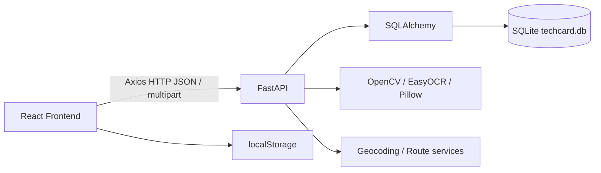

# アーキテクチャ

## システム構成

FrontendはReact Routerで画面を切り替え、AxiosでBackendのREST APIを呼び出します。BackendはFastAPI Router、SQLAlchemy、SQLiteで構成されています。

## モジュール構成

|層|実体|役割|
|---|---|---|
|Frontend entry|`frontend/src/index.tsx`|Reactアプリケーションのエントリーポイント|
|Frontend routing|`frontend/src/App.tsx`|SidebarとReact Routerによる画面構成|
|Frontend pages|`frontend/src/pages/`|Dashboard、Contacts、NetworkGraphなどの画面|
|Frontend components|`frontend/src/components/`|地図、クロップ、ROI、パネルなどのUI部品|
|Frontend services|`frontend/src/services/`|Axios API呼び出し|
|Backend entry|`backend/app/main.py`|FastAPI生成、CORS、Router登録、DB初期化|
|Backend routers|`backend/app/routers/`|リソース別API|
|Backend data access|`backend/app/crud.py`|SQLAlchemyを使うCRUD処理|
|Backend models|`backend/app/models.py`|SQLAlchemyモデルと関連テーブル|
|Backend schemas|`backend/app/schemas.py`|Pydantic入出力スキーマ|

## レイヤ構造

1. React pages/componentsが画面状態を管理する
2. `frontend/src/services/`がAxiosでAPIを呼び出す
3. FastAPI Routerがリクエストを受ける
4. Routerがschemas、crud、modelsを使って処理する
5. SQLAlchemyがSQLiteへアクセスする

画像処理は`cards.py`、`card_crop.py`、`ocr.py`に分かれています。ネットワーク・地図関連は`graph.py`、`stats.py`、`TechCardMap.tsx`、`NetworkGraph.tsx`に実装されています。

## 通信

- FrontendのAPIデフォルトURLは`http://localhost:8000`
- JSON APIはAxiosで通信
- 名刺画像はmultipart/form-dataまたは画像データ文字列を使用
- CORSは`main.py`で全Origin・全Method・全Headerを許可しています

## データフロー

- 連絡先登録: フォーム入力 → API → SQLAlchemy → SQLite → レスポンス → React state更新
- OCR: 画像アップロード → OCRジョブ起票 → ステータス取得 → 抽出結果をフォームへ反映
- 地図: `/stats/company-map`取得 → `TechCardMap`描画 → 地図操作・ルートAPI呼び出し
- ネットワーク: `/stats/network`取得 → ノード・エッジ整形 → ForceGraph描画 → localStorageへレイアウト保存
