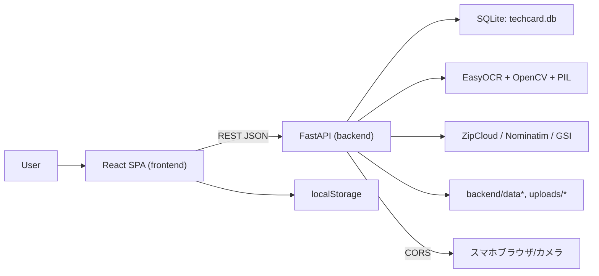

# Project Specification

## 1. プロジェクト概要

- アプリケーション名: `TechCard`
- 目的: 名刺情報（連絡先、会社、イベント、名刺画像）を統合管理し、タグ/技術情報・関係性をグラフ化して人脈可視化を行う。
- 想定ユーザー: エンジニア・営業・イベント運営者など、名刺由来のネットワーク情報を構造化して扱う個人ユーザー。
- 解決する問題:
  - 名刺画像の手入力負荷を減らす（OCR + ROI抽出）
  - 連絡先・会社・イベント・技術の紐付けを一元化
  - 会社地図表示とネットワーク図で見取り図を作成
- 使用環境:
  - macOS + VS Code
  - 開発起動: frontend `localhost:3000`, backend `localhost:8000` (HTTP), `localhost:8443` (HTTPS起動時)
  - Python 3.11.8（README明記）

## 2. 技術スタック

- フロントエンド
  - React 18, TypeScript 4.9.5
  - TailwindCSS 3
  - axios
  - react-router-dom 6
  - react-force-graph-2d
  - react-map-gl / maplibre-gl
  - react-konva / konva
  - qrcode.react
- バックエンド
  - Python 3.11
  - FastAPI
  - SQLAlchemy
  - Pydantic
  - SQLite (`sqlite:///./techcard.db`)
- 言語
  - TypeScript
  - Python
- フレームワーク
  - React
  - FastAPI
- ビルドツール
  - frontend: `react-scripts`（start/build/test）
  - backend: `uvicorn app.main:app --reload`
- データ保存方法
  - DB: `backend/techcard.db`（SQLite）
  - ファイル: `backend/data/*`, `backend/uploads/*`（画像、モバイルアップロード、ROI関連）
  - ブラウザ永続: `localStorage`
- AI関連ライブラリ
  - easyocr
  - opencv-python (cv2)
  - pillow, pillow-heif
- その他依存ライブラリ
  - qrcode
  - numpy
  - d3
  - python-multipart
  - requests to external geocode services via `urllib`（ZipCloud/Nominatim/GSI）
  - QR/Mapライブラリ等

## 3. プロジェクト構造

```text
project-root
├─ backend/
│  ├─ app/
│  │  ├─ main.py
│  │  ├─ database.py
│  │  ├─ models.py
│  │  ├─ schemas.py
│  │  ├─ ocr.py
│  │  ├─ routers/
│  │  │  ├─ contacts.py
│  │  │  ├─ companies.py
│  │  │  ├─ tags.py
│  │  │  ├─ meetings.py
│  │  │  ├─ cards.py
│  │  │  ├─ graph.py
│  │  │  ├─ stats.py
│  │  │  ├─ events.py
│  │  │  ├─ card_crop.py
│  │  │  ├─ company_groups.py
│  │  │  ├─ mobile_upload.py
│  │  │  └─ admin.py
│  │  └─ services/
│  │     └─ tech_extractor.py
│  ├─ certs/
│  ├─ data/
│  │  ├─ cards/
│  │  ├─ mobile_uploads/
│  │  └─ roi_templates/
│  ├─ uploads/
│  │  └─ mobile_cards/
│  ├─ logs/
│  ├─ requirements.txt
│  ├─ script(s)
│  └─ techcard.db
└─ frontend/
   ├─ public/
   ├─ src/
   │  ├─ App.tsx
   │  ├─ components/
   │  ├─ pages/
   │  └─ types/
   ├─ package.json
   └─ src index files
```

- `backend/app/models.py`:
  - ORMエンティティ、関連テーブル定義、初期化・マイグレーション的再整形
- `backend/app/schemas.py`:
  - API入出力型（Pydantic）
- `backend/app/routers/*`:
  - リソース別ルーティング
- `backend/app/services/*`:
  - 技術タグ抽出
- `frontend/src/components`:
  - 共通UI（Sidebar, map, crop/ROI, overlay, context panel等）
- `frontend/src/pages`:
  - 画面単位ルーティング

## 4. アプリケーションアーキテクチャ

### UI構造
- `App.tsx` が全体レイアウト（`Sidebar` + `<Routes>`）を保持
- `Sidebar` から主要画面（Dashboard, Contacts, Card Registration, Companies, Events, Timeline, Network, Insights）へ遷移
- 主要画面は機能別に `pages/*` で分離

### データフロー
1. ユーザーイベント -> フロント状態更新
2. 必要時 API 呼び出し -> `FastAPI` 実行
3. サーバ側でDB更新/計算/OCR/外部API
4. 応答JSONを受け取りUI反映
5. 長時間処理は `localStorage` やジョブ状態 (`OCR_JOBS`) で同期

### API通信
- 通信方式: HTTP JSON（axios）
- ベースURL（実装上）: `http://localhost:8000`
- データ送信:
  - JSON (`axios.post/put/get/delete`)
  - multipart (`UploadFile`): 名刺画像、ロールアップロード等

### 状態管理
- フロント: `useState/useEffect/useMemo/useCallback` + `localStorage`（UI状態の永続）
- バック: `SQLAlchemy` セッション + in-memory辞書（ジョブ/キャッシュ）

### AI処理
- OCR・文字領域推定・名刺検出は backend で実行
- フロントはROI座標調整UI、画像送信、結果反映のみ

### ファイル保存
- DB:
  - `backend/techcard.db`
- ファイル保存:
  - 名刺アップロード: `backend/data/cards`
  - モバイルアップロード: `backend/data/mobile_uploads`, `backend/uploads/mobile_cards`
- ブラウザ永続:
  - レイアウト/状態/ROI/展開情報を `localStorage`



## 5. 機能一覧

| 機能名 | 説明 |
|---|---|
| 連絡先管理 | 連絡先の CRUD、重複チェック、自己フラグ管理、タグ紐付け |
| 会社管理 | 会社 CRUD、グループ紐付け、会社詳細（所属連絡先・技術集約） |
| タグ管理 | タグ CRUD、種別（tech/event/relation）、テキストからのタグ抽出 |
| 名刺取り込み | 画像アップロード、名刺枠自動検出、ROI OCR、連絡先登録データ反映 |
| スマホ撮影連携 | QR表示、HTTP/簡易撮影アップロード、最新画像ポーリング |
| イベント管理 | イベント作成、参加者追加/削除、イベント詳細 |
| 会議ログ | Meeting（連絡先ごとのメモ付き履歴） |
| ネットワーク可視化 | `/stats/network` をベースにノード表示、フィルタ、検索、ドラッグ |
| 地図表示 | 会社連携・ジオコーディング、診断情報表示 |
| ダッシュボード | サマリー統計、最近接触した連絡先、地図描画 |
| 技術検索/Insights | 技術/イベント/グループ集約表示 |
| 時系列表示 | イベント一覧・年別/日別の簡易タイムライン |
| レイアウト永続化 | ネットワークノード位置/ラベル位置保存、Grid設定保存 |
| 固定ノード制御（重要） | グリッドOFF時、固定ノードはドラッグで移動不可。`レイアウトリセット`実行後にのみ再配置可 |
| シャットダウン | `/admin/shutdown`（PID基盤） |

## 6. 画面仕様

## 6.1 Dashboard (`/`)
画面目的: 全体状況を1画面で確認する集約ダッシュボード。  
UI構成: 統計カード、最近の連絡先カード、会社地図/地図診断。  
イベント: 起動時データ取得（`/stats/summary`, `/stats/company-map`）, 地図更新時再取得, `geocode failed` 警告表示。

## 6.2 Contacts (`/contacts`)
画面目的: 全連絡先の一覧・分類・検索。  
UI構成: 並び順セレクト、グループ/会社ツリー展開、連絡先カード。  
イベント: GET `/contacts/` と `/company-groups` 読込, `localStorage` の展開状態保存・復元, 連絡先リンク遷移。

## 6.3 ContactDetail (`/contacts/:id`)
画面目的: 連絡先の詳細確認・操作。  
UI構成: 基本情報、タグ、イベント履歴、ミーティング、名刺一覧。  
イベント: 連絡先取得、名刺削除、自己フラグ切替（PUT `/contacts/:id/self`）、編集画面遷移、削除。

## 6.4 ContactRegister / Contact Edit (`/contacts/register`, `/contacts/:id/edit`)
画面目的: 新規登録・編集。  
UI構成: ファイル入力/カメラ入力、名刺枠自動検出、手動クロップ、ROI編集（各項目ROI）、OCR実行、タグ選択、タグ管理。  
イベント:  
- 画像選択/撮影/補正  
- `/card/detect` で自動4点検出  
- `/card/crop` でクロップ  
- `/cards/ocr-region` でROI OCR  
- `/tags/extract` でタグ抽出  
- `/contacts/register` or `/contacts/:id/register` 登録  
- スマホ連携: `/api/mobile-upload/info` 取得、`/api/mobile-upload/latest` ポーリング  
- ROIテンプレート保存/復元: `localStorage` キー `techcard_roi_template`

## 6.5 CardUpload (`/card-upload`)
画面目的: `/cards/upload` を直接試す補助画面。  
UI構成: 画像選択、進捗表示、job_id表示。  
イベント: POST `/cards/upload` → job polling `/cards/upload/status/{job_id}`。

## 6.6 NetworkGraph (`/network`)
画面目的: 人・会社・技術・イベント・関係種別のネットワーク可視化。  
UI構成: ノード/エッジグラフ、タイプON/OFF、検索（tech/company/contact/event）、Grid設定、ハイライト、グループ折りたたみ。  
イベント:  
- GET `/stats/network` 初期取得  
- ノードクリックで詳細パネル/遷移  
- ノードドラッグ（位置保存）  
- `レイアウトリセット` で位置再初期化と保存クリア  
- 重要: Grid OFF時に固定ノードはドラッグ不可（fixed set に保持）。固定解除はレイアウトリセットで可能。  
- localStorage保存キー: `techcard_network_layout_v1`, `techcard_grid_config`

## 6.7 CompanyGroups (`/company-groups`)
画面目的: 会社グループの管理。  
UI構成: グループ一覧、新規/編集フォーム、エイリアス追加。  
イベント: CRUD `/company-groups`, `/companies/{id}/group`, suggest API 参照。

## 6.8 CompanyDetail (`/company/:id`)
画面目的: 会社の詳細、所属連絡先、技術集合、グループ変更。  
UI構成: 会社情報、技術タグ、連絡先一覧。  
イベント: `/companies/{id}/detail` 表示, グループ変更（PUT）。

## 6.9 EventRegister (`/events`)
画面目的: イベント登録と参加者選択。  
UI構成: イベントフォーム、連絡先候補検索・複数選択、追加。  
イベント: GET `/contacts/`, POST `/events`, POST `/events/{id}/participants`。

## 6.10 EventDetail (`/events/:id`)
画面目的: イベント詳細と参加者管理。  
UI構成: イベント情報、参加者一覧、追加/削除。  
イベント: GET `/events/:id`, DELETE `/events/{id}/participants/{contact_id}`, イベント一覧表示。

## 6.11 Insights (`/insights`)
画面目的: ネットワークデータを技術/イベント/会社単位で集約表示。  
UI構成: 統計パネル、集計カード、補助リスト。  
イベント: GET `/stats/network` を種別で集約。

## 6.12 Timeline (`/timeline`)
画面目的: 年別イベント一覧の時系列確認。  
UI構成: 年別/日別折りたたみ表示。  
イベント: GET `/events`, 必要ならイベント詳細展開で `/events/:id` 呼び出し。

## 6.13 TechnologySearch (`/technology-search`)
画面目的: 技術名文字列入力でのフィルタ入口。  
UI構成: 検索入力と結果表示（実装上は既存ルーティングとネットワーク/統計への連携を前提）。

## 7. API仕様

### 共通
- CORS: `*`許可
- ルートプレフィックスあり: `/contacts`, `/companies`, `/tags`, `/meetings`, `/cards`, `/graph`, `/stats`, `/events`, `/company-groups`, `/mobile-upload`, `/api/mobile-upload`, `/card`, `/admin`

### エンドポイント一覧（実装対象）

## 7.1 Contacts
| Method | Endpoint | 説明 |
|---|---|---|
| POST | /contacts/ | 通常登録（ContactCreate） |
| POST | /contacts/register | 重複チェック付き登録（ContactRegisterRequest） |
| GET | /contacts/?skip&limit | 一覧取得 |
| GET | /contacts/{id} | 連絡先詳細 |
| PUT | /contacts/{id} | 通常更新 |
| PUT | /contacts/{id}/register | 重複チェック付き更新 |
| PUT | /contacts/{id}/self | is_self 更新 |
| DELETE | /contacts/{id} | 削除 |

## 7.2 Companies
| Method | Endpoint | 説明 |
|---|---|---|
| POST | /companies/ | 会社作成 |
| GET | /companies/ | 一覧 |
| GET | /companies/{id} | 会社詳細（基本） |
| GET | /companies/{id}/detail | 会社詳細（集約情報） |
| PUT | /companies/{id} | 更新 |
| PUT | /companies/{id}/group | 所属グループ更新 |
| DELETE | /companies/{id} | 削除 |

## 7.3 Tags / Group
| Method | Endpoint | 説明 |
|---|---|---|
| POST | /tags/ | タグ作成 |
| GET | /tags/ | タグ一覧 |
| GET | /tags/{id} | タグ取得 |
| PUT | /tags/{id} | タグ更新 |
| DELETE | /tags/{id} | 削除 |
| POST | /tags/extract | テキストからタグ抽出 |
| GET | /company-groups | グループ一覧 |
| POST | /company-groups | グループ作成 |
| PUT | /company-groups/{id} | グループ更新 |
| POST | /company-groups/{id}/aliases?alias=xxx | グループエイリアス追加 |
| GET | /company-groups/suggest?name=... | グループ候補 |

## 7.4 Meetings
| Method | Endpoint | 説明 |
|---|---|---|
| POST | /meetings/ | ミーティング作成 |
| GET | /meetings/ | 一覧 |
| GET | /meetings/{id} | 詳細 |
| PUT | /meetings/{id} | 更新 |
| DELETE | /meetings/{id} | 削除 |

## 7.5 Events
| Method | Endpoint | 説明 |
|---|---|---|
| GET | /events/ | イベント一覧 |
| GET | /events/{id} | イベント詳細（参加者/会社集合） |
| POST | /events/ | イベント作成 |
| POST | /events/{id}/participants | 参加者追加 |
| DELETE | /events/{id}/participants/{contact_id} | 参加者削除 |

## 7.6 Cards / OCR / Crop
| Method | Endpoint | 説明 |
|---|---|---|
| POST | /cards/upload | 画像非同期OCRジョブ作成 |
| GET | /cards/upload/status/{job_id} | ジョブ状態取得 |
| POST | /cards/ocr-region | ROI単位OCR |
| POST | /cards/ | 名刺レコード作成 |
| GET | /cards/ | 名刺一覧 |
| GET | /cards/{id} | 名刺詳細 |
| PUT | /cards/{id} | 名刺更新 |
| DELETE | /cards/{id} | 名刺削除 |
| POST | /card/detect | 名刺枠4点検出 |
| POST | /card/crop | 名刺トリミング |

## 7.7 Graph / Stats / Health系
| Method | Endpoint | 説明 |
|---|---|---|
| GET | /graph/network | フィルタ付きノード/エッジ生成 |
| GET | /stats/summary | ダッシュボード要約 |
| GET | /stats/network | ネットワーク集約 |
| GET | /stats/company-map | 会社マップ（ジオコーディング） |
| GET | /stats/company-map/diagnostics | 住所/ジオコーディング診断 |
| GET | /stats/network?technology&company&person | ネットワーク絞り込み |

## 7.8 Mobile Upload / Admin
| Method | Endpoint | 説明 |
|---|---|---|
| POST | /mobile-upload/sessions | セッション作成 |
| GET | /mobile-upload | ルートHTML |
| GET | /mobile-upload/{session_id} | セッションHTML |
| GET | /mobile-upload/{session_id}/status | ステータス |
| POST | /mobile-upload/{session_id}/image | 画像受信 |
| GET | /mobile-upload/{session_id}/image | 画像返却 |
| GET | /mobile-upload/{session_id}/qr | QR PNG |
| GET | /api/mobile-upload/info | API基本URL取得 |
| POST | /api/mobile-upload | スマホ向け画像アップロード |
| GET | /api/mobile-upload/latest | 最近アップロード情報 |
| GET | /api/mobile-upload/files/{filename} | 画像配信 |
| POST | /admin/shutdown | プロセス停止 |

### リクエスト/レスポンス例（JSON）

#### 例1: `POST /contacts/register`
```json
{
  "name": "山田 太郎",
  "email": "yamada@example.com",
  "phone": "03-1234-5678",
  "mobile": "090-1111-2222",
  "role": "Backend Engineer",
  "company_name": "ABC株式会社",
  "branch": "本社",
  "postal_code": "160-0023",
  "address": "東京都新宿区...",
  "first_met_at": "2026-03-01",
  "tags": ["Python", "FastAPI"],
  "tag_items": [{ "name": "Python", "type": "tech" }],
  "notes": "展示会で名刺交換",
  "card_filename": "upload_1234.png",
  "ocr_text": "..."
}
```
```json
{
  "id": 21,
  "name": "山田 太郎",
  "email": "yamada@example.com",
  "is_self": false,
  "tags": [{ "id": 4, "name": "Python", "type": "tech" }],
  "company": { "id": 11, "name": "ABC株式会社" },
  "business_cards": [{ "id": 7, "filename": "upload_1234.png" }]
}
```

#### 例2: `POST /cards/upload`
```json
{ "file": "[multipart: image]" }
```
```json
{ "job_id": "uuid-string" }
```

#### 例3: `GET /cards/upload/status/{job_id}`
```json
{
  "status": "done",
  "progress": 100,
  "result": {
    "name": "山田 太郎",
    "company": "ABC株式会社",
    "branch": "本社",
    "role": "マネージャ",
    "email": "yamada@example.com",
    "phone": "03-1111-2222",
    "mobile": "090-1111-2222",
    "address": "東京都...",
    "raw_text": "..."
  },
  "error": null
}
```

## 8. データモデル

### Python風エンティティ（論理定義）
```ts
type Contact = {
  id: number
  name: string
  email?: string
  phone?: string
  role?: string
  mobile?: string
  postal_code?: string
  address?: string
  branch?: string
  first_met_at?: string // YYYY-MM-DD
  company_id?: number
  notes?: string
  is_self?: boolean
  tags: Tag[]
  tech_tags?: Tag[]
  events?: Event[]
  meetings?: Meeting[]
  business_cards?: BusinessCard[]
}

type Company = {
  id: number
  name: string
  group_id?: number
  postal_code?: string
  address?: string
  latitude?: number
  longitude?: number
  geocoded_at?: string
  geocode_note?: string
  contacts?: Contact[]
}

type Tag = {
  id: number
  name: string
  type: 'tech' | 'event' | 'relation'
}

type Event = {
  id: number
  name: string
  start_date?: string
  end_date?: string
  location?: string
  year?: number
  contact_ids: number[]
}

type Meeting = {
  id: number
  contact_id: number
  timestamp: string
  notes?: string
}

type BusinessCard = {
  id: number
  filename: string
  ocr_text?: string
  contact_id?: number
}
```

### ネットワーク図用モデル
```ts
type GraphNode = {
  id: string
  type: 'contact' | 'company' | 'group' | 'event' | 'tech' | 'relation'
  label: string
  size?: number
  role?: string
  email?: string
  phone?: string
  mobile?: string
  notes?: string
  company_node_id?: string
  is_self?: boolean
}

type GraphEdge = {
  source: string
  target: string
  type:
    | 'employment'
    | 'company_tech'
    | 'contact_tech'
    | 'event_attendance'
    | 'relation'
    | 'company_group'
    | 'company_relation'
    | 'group_contact'
  count?: number
}
```

### 重要リレーション
- `Contact` ↔ `Tag` : `contact_tags` (M:N)
- `Contact` ↔ `Tag` : `contact_tech_tags`（技術）
- `Company` ↔ `Tag` : `company_tech_tags`
- `Company` ↔ `Contact` : 1:N
- `Contact` ↔ `Event` : `event_contacts` (M:N)
- `Contact` ↔ `BusinessCard` : 1:N
- `Contact` ↔ `Meeting` : 1:N
- `CompanyGroup` ↔ `Company` : 1:N
- `CompanyGroup` ↔ `CompanyGroupAlias` : 1:N

## 9. AI処理仕様

- 画像前処理（OCR）
  - 入力: 画像ファイル（名刺）
  - 処理: EXIF補正、RGB変換、横長判定回転、最大辺2000縮小、二系統前処理（鋭化/閾値/CLAHE）、`easyocr.Reader(["ja","en"], gpu=False)` 2系統推定
  - 出力: テキスト抽出結果（文字列/座標情報）→ フィールド抽出

- フィールド抽出（`extract_fields`）
  - 正規化対象: メール（記号崩れ補正）、名前（文字間正規化）、会社名（法人表記ノイズ除去）、役職、電話/携帯の分類、住所/郵便コード抽出
  - 出力: `name/company/branch/role/email/phone/mobile/raw_text`

- 名刺枠検出（`/card/detect`）
  - 入力: data URL の画像
  - 処理: 輪郭/直線検出＋スコアリング、候補評価、矩形補正
  - 出力: 4点座標、score、source

- 名刺クロップ（`/card/crop`）
  - 入力: data URL + 4点
  - 処理: 射影変換でトリミング
  - 出力: base64 PNG (`cropped_image`)

- ROI OCR（`/cards/ocr-region`）
  - 入力: `field` + `image`（Form）
  - 処理: 領域切り出し → OCR
  - 出力: `{field, text}`

- 技術タグ抽出（`/tags/extract`）
  - 入力: `text`
  - 処理: KEYWORDS一致 + ロール辞書ヒューリスティック
  - 出力: `tags: string[]`（重複排除）

- ジオコーディング（`/stats/company-map`）
  - 入力: 会社住所/郵便番号
  - 処理: ZipCloud優先→GSI→Nominatim、キャッシュ/同時実行制御
  - 出力: `lat/lon` + 地図表示ポイント + 進捗

## 10. 状態管理

- backend
  - 永続: SQLite（`techcard.db`）  
  - 非永続（プロセス内）:  
    - `cards` OCRジョブ: `OCR_JOBS: dict[str, {status,progress,result,error}]`
    - 画像アップロード状態: `MOBILE_UPLOADS`, `LATEST_UPLOAD`
    - グローバルジオコーディングキャッシュ: `_ADDRESS_GEOCODE_CACHE`

- frontend
  - コンポーネントローカル state が基本（`useState`）
  - 永続化:
    - `techcard_network_layout_v1`（ノード座標/固定/ラベル）
    - `techcard_grid_config`（Grid設定）
    - `contacts:expandedGroups`, `contacts:expandedCompanies`（展開状態）
    - `techcard_roi_template`（ROIテンプレート）
  - 画面間共有:
    - propsとURLパラメータで遷移
    - グローバルストアは未使用

## 11. UIデザインルール

- レイアウト: 左サイドバー + メインコンテンツの2カラム固定構成
- スタイリング: Tailwind utility + カスタムCSS（限定）
- コンポーネントは「ページ」「コンポーネント分離」を維持
- レスポンシブ:
  - Dashboard/Contactは `flex` + `overflow` 前提、コンテナ可変
- 色設計:
  - ノードタイプ別色、ハイライト/フェードにコントラスト差分
- 文字・アイコン:
  - 可読性重視の通常フォント（標準サンセリフ）
- キーインタラクション:
  - 検索、トグル、シングルクリック遷移、確認ダイアログ、進捗表示
- モバイル:
  - 直接QR取得はHTTPS推奨（非HTTPS時はファイル選択フォールバック）

## 12. 実装ルール

- 既存構造を優先して変更（Router、ページ構成、モデル名、既存型を保持）
- APIパスは `http://localhost:8000` を前提（必要なら定数化）
- `ContactRegister`/`NetworkGraph` で既に持つロジック順序を崩さない
- DB変更時は `models.py` 変更後、`main.py` の起動時互換修正と整合性を確認
- 重要: 固定ノード制御は `NetworkGraph.tsx` の `fixedNodeIdsRef` と `localStorage` 整合を保つ
- 既存ルートの副作用を増やす変更は避ける（`admin/shutdown` 等）
- バックエンド例外は明示的に HTTP例外に変換
- UIイベント多発箇所はデバウンス/ローディングガードを維持

## 13. エラーハンドリング

- API失敗
  - 400: 入力不足・不正フォーマット（例: 重複判定失敗、画像不正）
  - 404: リソース未存在（contacts/companies/eventsなど）
  - 409: 重複（連絡先名 + 会社）
  - 422: バリデーション
  - 500: OCR/処理失敗時の内部例外
- AI処理失敗
  - OCR例外時: 空結果 or エラーメッセージ
  - 名刺検出未検出時はフォールバック継続（手動クロップへ）
  - ジョブ未完了時: `status/error` で進捗表示
- UIエラー
  - ネットワーク障害: トースト/アラート表示
  - ポーリングタイムアウト/失敗: 再試行 or ステータス表示
  - 不明エラー: `detail` 優先、なければ共通文言を表示

## 14. パフォーマンス設計

- 重い処理の非同期化
  - OCRジョブはバックグラウンド実行 + `job_id` ポーリング
- 地図/ジオコーディング
  - キャッシュ `_ADDRESS_GEOCODE_CACHE`、`_GEOCODE_SEMAPHORE` で同時実行制御
- UI最適化
  - レイアウト保存は300msデバウンス
  - 画像処理前のリサイズ（1200x700）で送信負荷削減
  - 検索入力は遅延反映
- メモリ管理
  - 大きい画像は都度圧縮・Data URL化時に解放を意識
  - in-memoryキャッシュ（ジョブ/アップロード）は再起動で消える前提で設計

## 15. セキュリティ

- CORS はワイルドカード `*`（開発優先）
- 認証/認可は未実装（API利用保護なし）
- バックエンドは起動時に既存DB列の補正/再作成処理を実行（制約付き）
- ファイルアップロードは拡張子・画像変換を通すが、厳密なウイルス対策は未実装
- `admin/shutdown` はPIDファイルベースで停止、運用制御は未認証
- HTTPSはオプション起動（証明書有無依存）

## 16. 開発手順

1. `python3.11` + `backend/.venv` を用意し、`pip install -r requirements.txt`
2. `backend` 起動: `python -m uvicorn app.main:app --reload --host 0.0.0.0 --port 8000`
3. `frontend` 起動: `npm install && npm start`
4. DB確認: `backend/techcard.db` 作成と起動時マイグレーションログ確認
5. 主要画面順に実装追加:
   1) モデル/スキーマ更新
   2) ルータ追加
   3) フロント状態/呼び出し追加
   4) 画面/コンポーネント追加
   5) localStorageキー追加（必要なら移行方針）
6. 影響範囲確認:
   - Contacts, NetworkGraph, Stats, CardUploadの最小シナリオを通す
7. ルート変更時は `App.tsx` + ナビゲーションとAPI連携を同時更新
8. 外部サービス依存（地図/HTTPS）を含む画面は手動確認

## 17. TODO

- 認証・認可（JWT/OAuth）を追加
- バックエンドAPIのバリデーション/エラーメッセージ統一
- GraphQLやOpenAPI自動生成の厳密化（型生成）
- ジョブ永続化（Redis / DB queue）導入（現在はメモリ）
- ファイル保存のローテーション・サイズ制限・削除ポリシー整備
- `TypeScript` で `any` 排除の徹底（既存箇所は局所的に存在）
- 統合テスト（API + E2E）追加
- CORSを環境別許可に変更（本番はホワイトリスト化）

## 18. AIへの指示

- 既存ディレクトリ構造とルート（`backend/app/routers`, `frontend/src/pages`, `frontend/src/components`）を維持して実装
- 変更前に対象ファイルの責務を崩さない
- API仕様を先に確定し、リクエスト/レスポンスキー名を固定
- 既存フィールド名（`company_name`, `tag_items`, `first_met_at`, `is_self`）は変更しない
- `NetworkGraph` の固定ノード仕様を破らない:
  - `fixedNodeIdsRef` と `techcard_network_layout_v1` の同時整合
  - Grid OFF時、固定ノードはドラッグ不可
  - `レイアウトリセット`で固定解除
- 例外は握りつぶさない。必要なら明示的メッセージで `detail` を返す
- コード中心、説明最小、変更差分を小さくする
- 実装時は型を明示し、DTO/モデル名の変更は避ける

## 19. AI Coding Entry Point

AIが最初に読むべきファイル

frontend/src/App.tsx
backend/app/main.py

フロントとバックエンドのエントリーポイント。

実装変更時はこの2ファイルから
影響範囲を確認すること。

---
